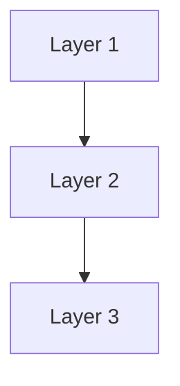

# Phase {N} 设计方案

> **目标**: {一句话描述本阶段目标}
> **日期**: YYYY-MM-DD
> **阶段**: Phase {N} - {阶段名称}

---

## 1. 背景与目标

### 1.1 当前状态

**Phase {N-1} 已完成**：
- ✅ 成果1
- ✅ 成果2

**当前局限性**：
- ❌ 局限性1
- ❌ 局限性2

### 1.2 Phase {N} 目标

**核心目标**：{描述核心目标}

**关键价值**：
1. 价值点1
2. 价值点2
3. 价值点3

### 1.3 设计原则

- **原则1** - 说明
- **原则2** - 说明
- **原则3** - 说明

---

## 2. 技术架构

### 2.1 整体架构



### 2.2 核心组件设计

#### 2.2.1 组件名称

**职责说明**：
- 职责1
- 职责2

**代码结构**：
```python
class ComponentName:
    """组件说明"""
    def method(self):
        pass
```

---

## 3. 数据模型

### 3.1 数据库Schema

```sql
CREATE TABLE table_name (
    id UUID PRIMARY KEY,
    field_name VARCHAR(100),
    created_at TIMESTAMP DEFAULT CURRENT_TIMESTAMP
);
```

### 3.2 API 设计

#### 端点定义

```http
GET /api/v1/resource
Authorization: Bearer <token>
```

**响应**：
```json
{
  "data": {},
  "status": "success"
}
```

---

## 4. 实施计划

### 4.1 任务分解

#### Week 1: 分类
- [ ] Task 1: 任务名称 (1-2天)
- [ ] Task 2: 任务名称 (3-4天)

#### Week 2: 分类
- [ ] Task 3: 任务名称 (2-3天)

### 4.2 时间估算

| 任务 | 预估时间 | 依赖项 |
|------|----------|--------|
| Task 1 | 2天 | - |
| Task 2 | 3天 | Task 1 |

---

## 5. 测试策略

### 5.1 测试类型

- **单元测试**: 覆盖率 ≥ 80%
- **集成测试**: 关键流程 100%
- **性能测试**: 指标要求

### 5.2 测试工具

- pytest (单元测试)
- locust (性能测试)
- pytest-cov (覆盖率)

---

## 6. 监控与运维

### 6.1 监控指标

```python
# Prometheus 指标
metric_name = Gauge(
    'metric_name',
    'Description'
)
```

### 6.2 日志规范

- 日志级别: DEBUG, INFO, WARNING, ERROR
- 日志格式: JSON
- 必须包含: timestamp, level, message, context

---

## 7. 安全考虑

### 7.1 安全措施

1. **措施1** - 说明
2. **措施2** - 说明

### 7.2 审计日志

记录内容：
- 操作类型
- 操作者
- 操作时间
- 操作结果

---

## 8. 成功标准

### 8.1 功能完整性

- ✅ 功能1
- ✅ 功能2

### 8.2 性能指标

- 响应时间 < X ms
- 吞吐量 > Y req/s

### 8.3 质量保证

- 测试覆盖率 > 80%
- 所有测试通过

---

## 9. 风险与挑战

### 9.1 技术风险

| 风险 | 影响 | 应对措施 |
|------|------|----------|
| 风险1 | 高 | 措施1 |
| 风险2 | 中 | 措施2 |

### 9.2 时间风险

- 风险点1
- 应对方案

---

## 10. 后续规划

### 10.1 Phase {N+1} 预览

- 预期功能1
- 预期功能2

### 10.2 持续改进

- 改进点1
- 改进点2

---

## 附录

### A. 环境变量

```bash
# 配置项1
CONFIG_KEY=value
```

### B. 相关文档

- [规约文档](CONVENTIONS.md)
- [Phase {N-1} 设计](phase{N-1}-design.md)

### C. 参考资料

- [参考1](URL)
- [参考2](URL)

---

**文档版本**: 1.0
**最后更新**: YYYY-MM-DD
**状态**: 待审核
**作者**: 作者名称
